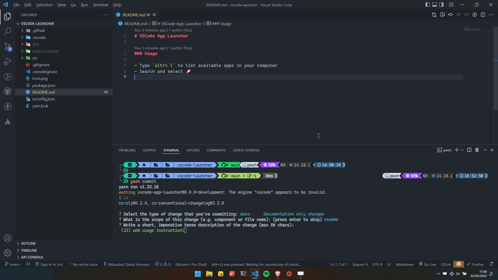

# VSCode App Launcher

### Usage

- Type `alt+l l` to list available apps in your computer
- Search and select 🚀

- Type `alt+l d` to launch the default app (you will be prompted for setting it if not found)
- Search and select 🚀
